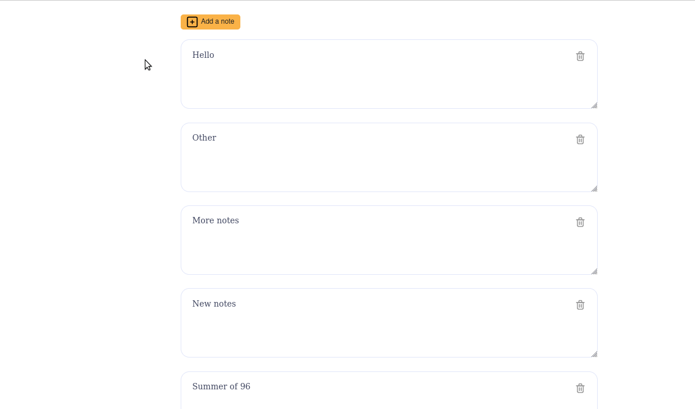
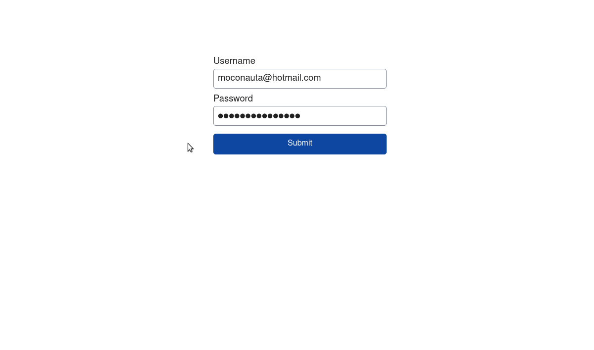
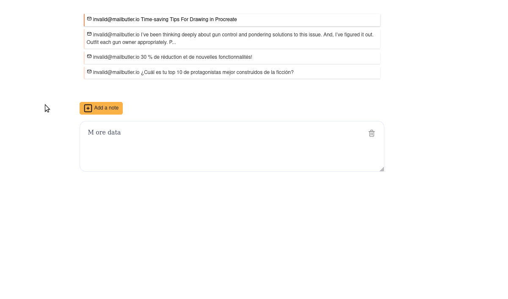
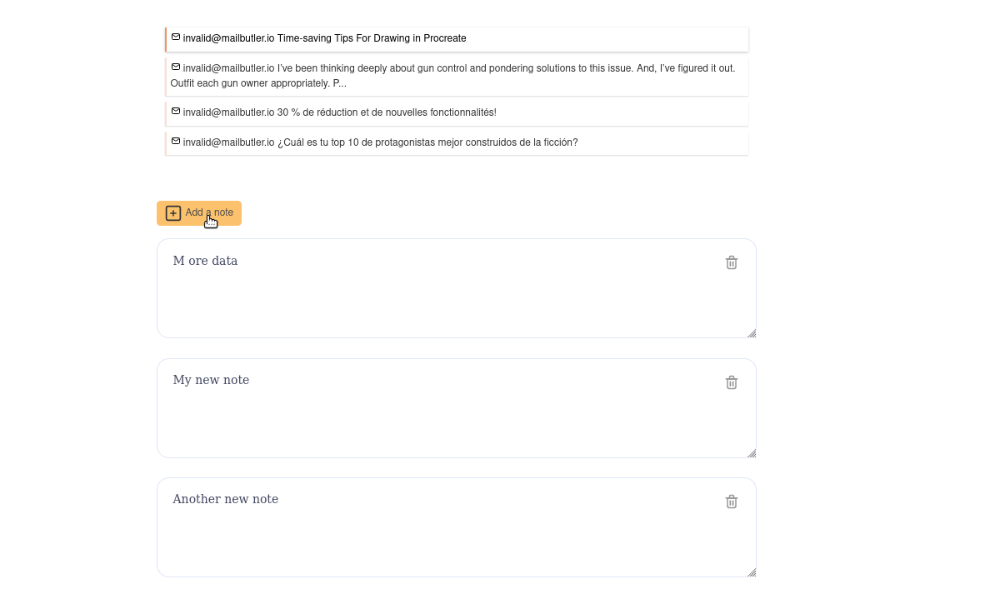
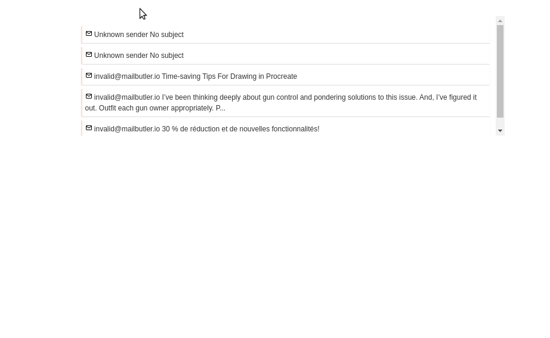
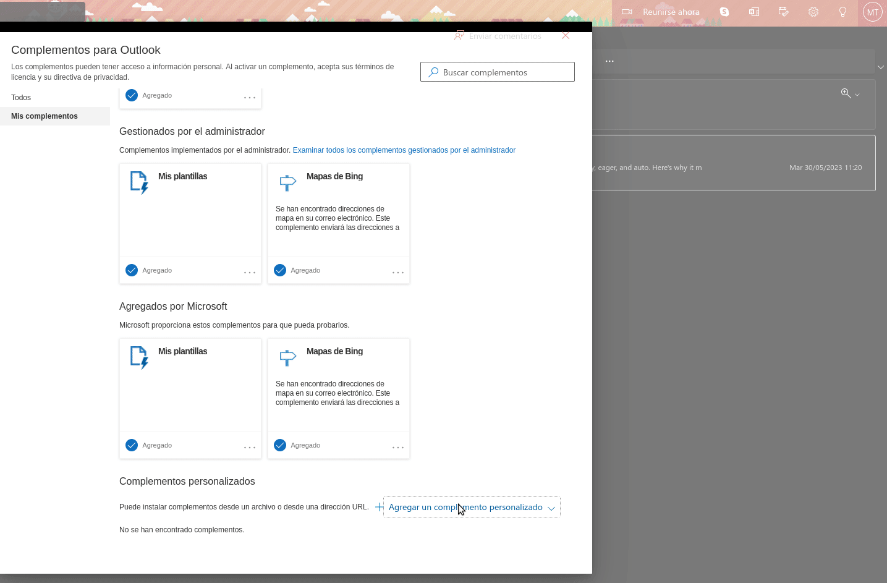

# Mailnotes
A client app to read emails and the attached notes. It allows to login through the corresponding API endpoints, read emails, read, edit, delete their notes as well as as adding new notes to any email.

### Stack  ###
Nuxt 2

Vue 2

Nuxt/Auth

Axios

Pinia

### Outlook Add-in Manifest ###
https://divagueame.github.io/mailnotes/manifest.xml

### Build Setup

```bash
# To run it locally:
$ yarn install
$ yarn dev

# build for production and launch server
$ yarn build
$ yarn start

# generate static project
$ yarn generate
```

### 1 - Start ###
Create new nuxt app

### 2 - Setup Nuxtjs/Auth ###
Add nuxtjs/auth-next to handle auth logic through middleware. If user is not logged in, he'll be redirected to /login

### 3 - Show user status on navbar ###
Basic setup of the navbar showing the user auth status

### 4 - Types for notes && emails  ###
Adding types according to the openapi specs

### 5 - Setup Pinia and NotesStore ###
Add Pinia keep the state of the notes we'll retrieve from the server 

### 6 - Setup notesApi and render getNotes ###
Add a Api composition to keep all API requests to /notes. Retrieve the notes of currently selected email, add them to useNotesStore and display them on template.

### 7 - Render a textarea  for each note and add updateNote on notesApi ###
Render a component with a textarea for each note, and update the note when focus is changed. PATCH request on notesApi /notes/{note_id}.

### 8 - Create AddNoteForm component and add createNote to notesApi ###
Add a form to create a new note for the selected email

### 9 - Add deleteNote() to notesApi and add remove button ###
Add a button to remove a note

### 10 - Toggle AddNoteForm + Simple template + Basic styling ###
Add a ref to toggle the AddNoteForm and a few styling changes.

### 11 - Get emails and select an active email ###
Remove hardcoded selected email and fetch current emails.
Add activeEmail to know which one is the currently selected email.
Add utils composition with buildUrlQuery to able to pass an object to build queries. Update getNotes to use buildUrlQuery.

### 12 - Improve add note UI/UX ###
Add autoExpandTextarea functionality for new notes textarea
Add discard note and save buttons
Add styling for active email

### 13 - Add loading component ###
While data is being fetch, a loader is shown

### 14 - Load Office, manifest.xml, icons ###
Load Office add-in dependencies on head tag and initialize before Nuxt app, add manifest.xml and icon assets.
This site is being server from Github pages, some configuration is added for deployment on nuxt.config.


### Demos ###
#### Commit 10 ###


#### Commit 11 ###


#### Commit 12 ###
Save and discard

New note autoresize


#### Commit 13 ###


#### Commit 14 ###



